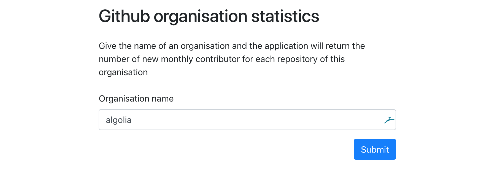

# Algolia Github Scraper

## Introduction

The code in this repository has been abstracted to give the number of new contributors per month for all the 
repositories hosted on Github of ANY company.

The program is launched from a web UI, on which the user can enter the name of the company he would like to get 
information from (algolia is pre-filled by default)



Once the task is launched, a web page gives you access to a monitoring page to watch the celery tasks execute.


When the task are finished, the user can get access to the results in multiple different format, by using the generated 
urls shown on the page after the task was launched (alternatively, an API is also available):

- JSON
- CSV
- GRAPHS

GRAPHS is a special bonus format where a web page is generated and all the repository stats computed are plotted. A 
search powered by algolia is also available to find more easily the wanted repository.

## Project description

#### Github contributor definition

A contributor has been defined as being the **author** of a commit, uniquely identifiable by its **email address**. 
Although this could mean that a person with multiple emails could represent 2 different contributors, this 
technique is preferred in order to take into account the persons with no github account, not recognised 
normally by the platform when computing Github contributors at the top of a repository page.

#### Code description

- Code is written mainly in **python3** using **celery** as the task manager and **flask** as the web server.
- A **redis** instance is used to keep track of the jobs
- **Flower** is used as a plugin library to keep track of all jobs status.
- Bonus: **Javascript** and **React** are used to create a searchable graphic visualisation of the computed statistics

The important files and folders to look at are:

- **server.py** - server file running flask
- **tasks.py** - file containing the celery tasks
- **github folder** - contains the functions used in the celery tasks to compute the github tasks
- **storage folder** - contains the functions to store and format the results produced by the celery tasks
- **static folder** - contains static assets as well as the csv file generated by the task

Other files and folders include:

- **algolia folder** - containing functions to interact with the Algolia API
- **assets folder** - contains css, javascript and webpack configuration for the website
- **templates folder** - basic html templates

#### What happens when a task is launched

When the submit button is pressed at on the **main page**, the following happens:

1. A celery task containing the name of the organisation is launched, to fetch all the repository names an organisation 
has

2. This task, once all the names are collected, launches before finishing, one task per repository name found

3. Each task launched is then responsible for collecting, computing and storing the statistics if the repository 
assigned to it. Statistics are stored in a CSV file available in the static/ folder.

4. When hitting the JSON endpoint, the results will be read and transformed into JSON, which will be sent back

## Live version

A [live version](http://ec2-18-130-173-9.eu-west-2.compute.amazonaws.com:5000/) is available to play around. 
Statistics for **Algolia** organisation have already been computed and results are available at the following urls:

- [JSON](http://ec2-18-130-173-9.eu-west-2.compute.amazonaws.com:5000/results/algolia/json)
- [CSV](http://ec2-18-130-173-9.eu-west-2.compute.amazonaws.com:5000/results/algolia/csv)
- [GRAPHS](http://ec2-18-130-173-9.eu-west-2.compute.amazonaws.com:5000/results/algolia)

## Running a Local version

This code can also be run locally. In order to simplify the process and prevent compatibility problems, docker is used 
to create 3 containers: 

- a redis instance
- a web server
- a flower server (used to monitor celery tasks)

#### Ports

2 ports need to be open on your local machine in order for the app to work: 

- port **5000**, for the web server
- port **5555**, for the flower server

#### Requirements

1. A machine with **docker** and **docker-compose** installed. To download the 2 programs, see:

- [docker installation](https://docs.docker.com/install/)
- [docker-compose installation](https://docs.docker.com/compose/install/)

2. In order to have a bigger request quota, you will need to go and get a github API Access Token available on 
your github account. Note that the application works without it, but the number of request per hour is limited 
(50 per hours).

- [Get Github API Access Token](https://github.com/settings/tokens)

3. (Optional) If you want to access the graphs page, an algolia API ADMIN KEY, SEARCH KEY and APP ID 
will be required.

#### Installation

1. Clone this repository

```bash
git clone https://github.com/paulvidal/Algolia-Github-Scraper.git
```

2. Go in the folder

```bash
cd Algolia-Github-Scraper
```

3. Create a `.env` file by replacing YOUR_VAR with the correct key

```bash
echo "GITHUB_KEY=YOUR_VAR" >> .env
``` 

(Optional) To use Algolia on the graphs page, add these variables to the `.env` file

```bash
echo "ALGOLIA_APP_ID=YOUR_VAR" >> .env
echo "ALGOLIA_SEARCH_KEY=YOUR_VAR" >> .env
echo "ALGOLIA_ADMIN_KEY=YOUR_VAR" >> .env
``` 

#### Running the application

4. Run docker-compose (still in Algolia-Github-Scraper/ folder)

```bash
docker-compose up
```

5. Go to the main page on port 5000 in your browser, [http://localhost:5000/](http://localhost:5000/)

6. Launch the process for an organisation (e.g. algolia)

7. **WAIT** for all the tasks to complete. To monitor them go to [http://localhost:5555/](http://localhost:5555/)

8. Request the wanted resource using the API (you can use the generated urls created after launching the task to 
help you)


#### API Documentation

The API to access the results once a task has finished executing after being launched 
at `http://localhost:5000/` offers the data in multiple different formats.


##### Json enpoints

2 enpoints are available to retrieve data in json format:

- Organisation results

Format: `/results/:organisation:/json`

Example: [http://localhost:5000/results/algolia/json](http://localhost:5000/results/algolia/json)

Returns: The number of new monthly contributors for all the repository of `:organisation:` in JSON format

```json
{
  "404-proxy":[
    {
      "date":"2018-03-01",
      "number_of_new_contributors":"1"
    },
    {
      "date":"2018-12-01",
      "number_of_new_contributors":"0"
    }
  ],
  "ABC-POC":[
    {
      "date":"2018-01-01",
      "number_of_new_contributors":"1"
    },
    {
      "date":"2018-12-01",
      "number_of_new_contributors":"0"
    }
  ]
}

```

- Repository of an organisation results

Format: `/results/:organisation:/:repository:/json`

Example: [http://localhost:5000/results/algolia/404-proxy/json](http://localhost:5000/results/algolia/404-proxy/json)

Returns: The number of new monthly contributors for `:repository:` of `:organisation:` in JSON format

```json
[
  {
    "date":"2018-03-01",
    "number_of_new_contributors":"1"
  },
  {
    "date":"2018-12-01",
    "number_of_new_contributors":"0"
  }
]

```

**Note:** `:organisation:` and `:repository:` are placeholders, which need to be replaced by the correct organisation or 
repository name

##### CSV endpoint

Format: `/results/:organisation:/csv`

Example: [http://localhost:5000/results/algolia/csv](http://localhost:5000/results/algolia/csv)

Returns: The number of new monthly contributors for all the repository of `:organisation:` in CSV format

##### GRAPHS endpoint

Format: `/results/:organisation:`

Example: [http://localhost:5000/results/algolia](http://localhost:5000/results/algolia)

Returns: A webpage with graphics of the number of new monthly contributors
for each repository of `:organisation:` in CSV format